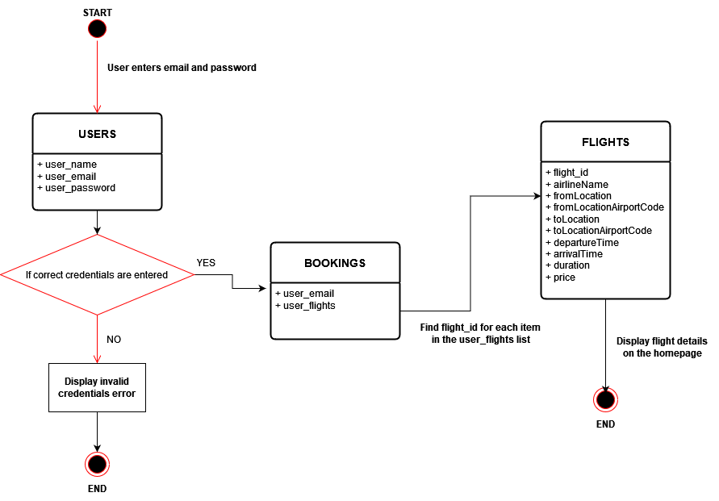

# INFS 740 Project

### Team Members

* Praneeth Ravuri (G01369627)
* Arishith Pakalapati (G01374702)

### Project Description

Horizon Airlines is a web application built with Flask and MongoDB, enabling users to easily book and manage flights. Users can view available flights, apply promo codes, and update their personal information, including email, name, and password. The site features a login authentication system and allows users to delete their account. The efficient booking system streamlines the process by only requiring payment information. In summary, Horizon Airlines offers a comprehensive airline management system with all essential features for an efficient booking experience.

#### Technologies

* Frontend - Html, CSS, Javascript
* Backend - Flask
* Database - MongoDB
* Visualization - Jupyter Notebook

#### Collections

* Users
* Flights
* Bookings
* Discount

#### Basic Queries (CRUD Operations)

* Create a new account
* Update name, email, and password of the user
* Cancel flights
* Check duplicate flight booking
* Check pre-existing users in the database
* Delete account of the user

#### Complex Queries

1. Collections used - Users, Flights, Bookings

<div>

<p>
In the login.html form, users enter their email and password which are checked against the corresponding records in the MongoDB users collection. If the credentials are correct, the bookings for that email are retrieved. If the user_flights list is empty, "No bookings found" is displayed on the homepage.html. Otherwise, for each flight in the user_flights list, the flight ID is used to search the flights collection in MongoDB and all information about that flight is displayed on the homepage.html.
</p>
</div>

<br>
<br>
<br>
<br>

2. Collections used - Users, Bookings, Flights

<div>

<p>
When the user selects the origin and destination locations, all available flights are displayed in flight.html. After selecting a flight, the user is directed to the payment page. Upon clicking the "confirm" button, if the user already has a booking with the same flight ID, an error is displayed. Otherwise, the flight ID is added to the user's booking list.
</p>
</div>

<br>
<br>
<br>
<br>

3. Collections used - Users, Bookings, Flights, discount (Bonus Complex Query)

<div>

<p>
After selecting the origin and destination locations, all available flights are displayed in flight.html. Upon selecting a flight, the user is redirected to the payment page where, upon clicking "confirm," the system checks if the user has already booked the same flight. If yes, an error message is displayed. Otherwise, the flight ID is added to the user's booking list. Additionally, if the user enters a valid promo code, the price of the flight ticket is reduced based on the code entered. However, if an invalid promo code is entered, an error message is displayed.
</p>
</div>

<br>
<br>
<br>
<br>

#### Website Screenshots

Login            |  Homepage
:-------------------------:|:-------------------------:
  |  

Search Flights          |  Payment
:-------------------------:|:-------------------------:
  |  

Update / Delete Account         |  Cancel Flight
:-------------------------:|:-------------------------:
  |  

#### Visualization

1. A bar graph is created using the list of cities from where flights are departing, which shows the most busiest cities.


2. A bar graph is generated using the list of cities to which flights are arriving, highlighting the most frequently visited cities.


3. A node graph is created to represent the flight paths originating from various cities, which also displays the interconnected flights between two destinations.


#### Conslusion

In conclusion, this project is a fully functional web-based flight booking system that provides users with a convenient way to search and book flights. The system is designed with a user-friendly interface and includes features such as flight search, booking, and payment.

Overall, this project serves as a practical example of how web-based applications can be designed to provide a seamless and personalized user experience, making the booking process easier and more efficient for users.

<hr>

### Project Setup

#### 1. Create virtual environment (Windows)

Delete ```env``` folder if it is already present in the project folder

```python -m venv env```

Navigate to ```env/Scripts```

Run the command ```activate``` and go to the main project folder

#### 2. Install necessary libraries

```pip install flask pymongo jupyter matplotlib```

#### 3. Go to services and check if MongoDB is running

#### 4. Initialize the MongoDB in Command Prompt

```mongod```

#### 5. In the virtual environment, run app.py

```python app.py```

#### Credentials, locations, promo codes

Credentials, locations, and promo codes can be found in the ```db_data``` folder. One can access them in the form of json or text files
